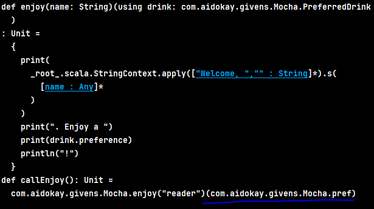

### Algo in Scala

FindMaxDiff from a List with constraint:
- Bigger number should have bigger index in the List

iterate from the second last element of the List, with the last one as the initial diff, keeps track
of the max number, whenever find a number before it is bigger, then make it as the max, and no other
changes, keep iteration, if the number is not bigger thant max, then calculate the new diff using max
and the number, compare the new diff with prev-diff, keep the bigger one, and keep iteration with the
remaining numbers in the List

### Setup Bloop

- Follow steps here:
  https://scalacenter.github.io/bloop/setup#sbt
  - add this line(version could be diff) to ~/project/plugins.sbt ( if not exist, create plugins.sbt) 

            addSbtPlugin("ch.epfl.scala" % "sbt-bloop" % "1.5.4")

    - run
      
            sbt bloopInstall
            
            ths command will create two files:
              -  .bloop/root.json
              -  .bloop/root-test.json

    - run 
  
            bloop projects

            it will show root and root-test
  
After this setup,compile will be much faster

###Refinement types
 - Nominal subtype
      
        A class (A) inherits from another (B), the first class (A) is said to be a nominal
        subtype of the other one (B). 
        It's a nominal subtype because each type has a name, and the names are explicitly
        declared to have a subtyping relationship.
- Givens
        
        Alias givens - the name to the left of the = sign is an alias for the value to the right
  - import
        
        import ABC.*  -- imports all members except given members
        to import givens, expliictly or 
           - import ABC.given, or
           - import ABC.{given XXX }  --- by type
           - import ABC.{given XXX[?]} -- all sub-type of XXX defined in ABC

  - Context parameters 
  
         Those that are defined in a using clause, compiler will insert context parameters to fix
         any errors due to missing parameter lists.
  - -Xprint:typer
         
         use this option to the compiler, it will show you what your code looks like after all 
         givens have been added by the type checker:
        
     
### Scala 2's implicit class in Scala 3 is more intuitive by using **extension**
```scala 3
  extension (list: List[Double])
    def +(other: List[Double]): List[Double] =
      (list zip other).map(t => t._1 + t._2)

  extension [A, C[_]](c: C[A]) {
    def flatMap[B](f: A => C[B])(using e: Execution[C]): C[B] = e.chain(c)(f)
    def map[B](f: A => B)(using e: Execution[C]): C[B] =
      e.chain(c)(f andThen e.create)
  }
```

Every for-comprehension composed with:
- every <- (being called a **generator**) is a nested **_flatMap_** call
- the **final generator** is a _**map**_ containing the _yield body_
```scala 3
            for {
                i <- a
                j <- b
                ij = i + j //will be in the body of b's map
                k <- c
            } yield (ij + k)
```
to
```scala 3
            a.flatMap {
              i => b.map { j => (j, i+j)}.flatMap{ 
                case (i, ij) => c.map{ //last map contains body of yield
                  k => ij + k  //body of yield
                }
              }
            }
```
### Abstract Members
* Abstract Val
  - an abstract val constrains its legal implementation: Any
    implementation must be a val definition; **_it may not be a var or a def_**
* Abstract Method
  - Abstract method declarations, on the other hand, may be implemented by
    both concrete method definitions and concrete val definitions

### Initializing abstract Vals
```
    new RationalTgrait:
      val numerArg = 1
      val denomArg = 2
```
* This expression yield an instance of an anonymous class that mixes in the trait and 
  is defined by the body
* `expr1` and `expr2` are evaluated as part of the initialization of the anonymous class,
  but the _anonymous class_ is initialized **_after_** the **RationalTrait**, so `numerArg`
  and `denomArg` are not available during the initialization of RationalTrait,
* Initialization order is not the same for class parameters and abstract fields.
  * Class parameter is evaluated before passed to the class constructor(unless by-name)
  * An implementing val definition in a subclass is evaluated only after the superclass 
    has been initialized
* Trait parametric fields let you compute values for fields of a trait before 
  the trait itself is initialized 

```
  trait RationalTrait(val numerArg: Int, val denomArg: Int):
```

### Lazy val
* a lazy val is never evaluated more than once. (its value is memoized)

### Akka Un-Typed Actors
* In Akka untyped, an actor is any object that is subclass of an abstract **Actor**
* And overrides `def receive: PartialFunction[Any, Unit]` method
### Akka Typed Actors
* Any well-defined behavior is a computation entity and thus can be declared to be an **Actor**
* The well-defined behavior in Akka is: `Behavior`, it limits the actors to receiving messages 
  of specific type only; the return type of the actor's behavior is required to be 
  the next `Behavior` of the same type with respect to inheritance
  * This way, it is possible to ensure at compile time that the actor will receive only messages 
    of the type it declares to handle
* Dispatchers make up the machinery that runs behaviors. Dispatchers use
  ExecutorServices to assign threads to actors 
* Akka Typed only supports the dispatchers definition from the
  configuration. Properties of the default dispatcher can be changed by
  overriding the settings under akka.actor.default-dispatcher .
* Actor addresses also need to be typed, and the type of address needs to be known at compile time
* Signal message types, which represent events in the life cycle of an actor and replace dedicated callback methods that were
  exposed by the Actor class in untyped Akka

### JDK-22 + Scala-3 + SBT
* Upgrade Scala 3 to 3.4.* (did not find 3.3.4 in maven repository)
* Upgrade SBT to 1.10.0 (build.properties)
* Reload SBT project
* All warnings, errors must be fixed, otherwise will see:
  _**No warnings can be incurred under -Werror (or -Xfatal-warnings)**_

### Leverage Java 19+ structured concurrency with OX 
* Once the code block passed to the scope completes, any daemon forks that are still running are interrupted
* Lifecycle of forks has predicatable boundaries


